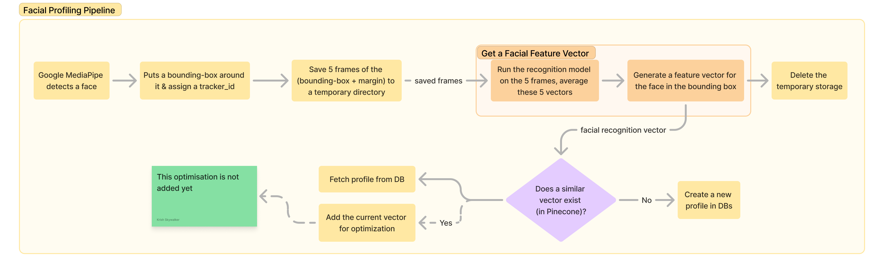
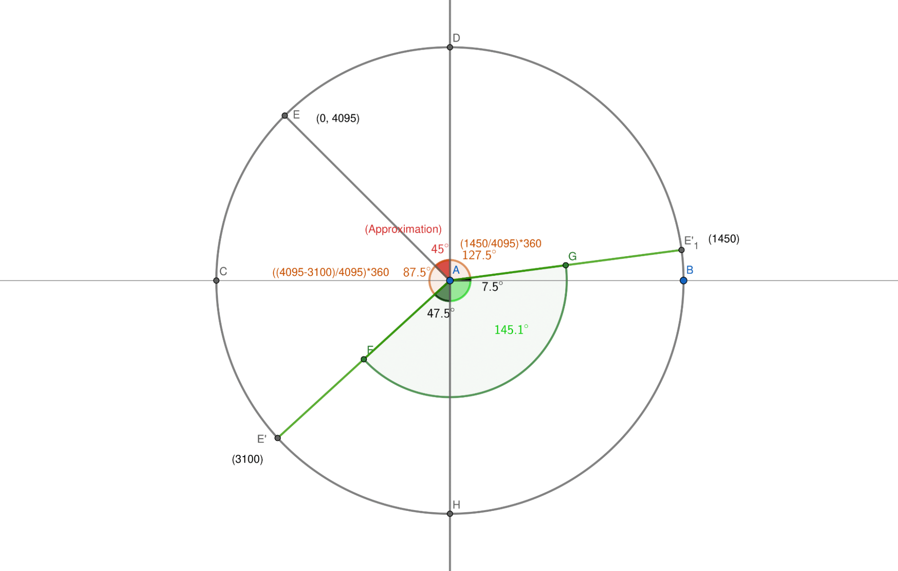
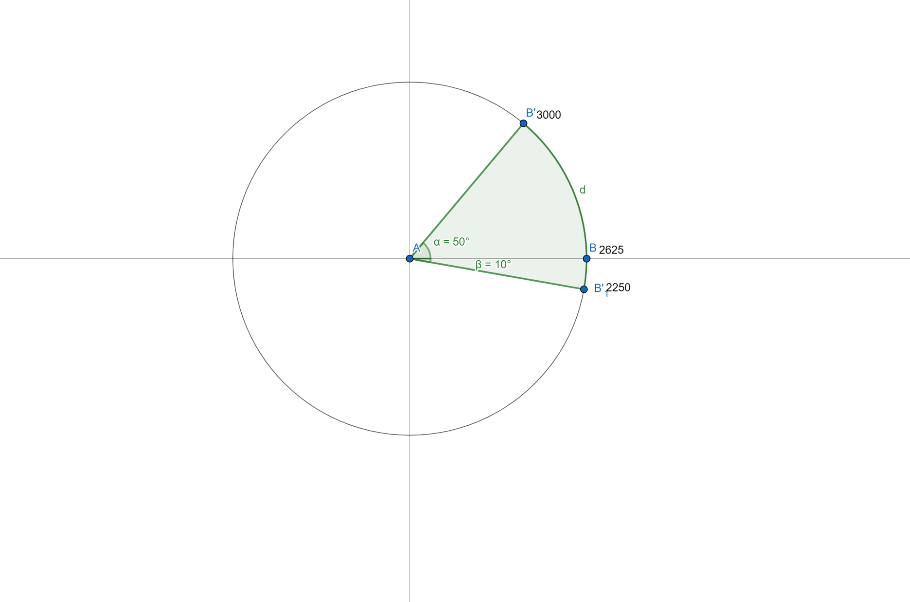

# Facial Profiling Pipeline

This project implements a real-time facial recognition system integrated with servo-controlled camera tracking (Feetech STS3032).





## Features

- Real-time face detection and tracking
- Servo-controlled camera movement (currently commented out)
- Feature vector extraction for facial recognition
- Pinecone integration for vector similarity search
- MongoDB integration for user profiles
- Asynchronous processing for improved performance

## Quick Start

1. Clone the repository and install dependencies:
   ```
   git clone https://github.com/krishgoel/realtime-facial-profiling.git
   cd facial-profiling-pipeline
   pip install -r requirements.txt
   ```

2. Set up environment variables in a `.env` file:
   ```
   PINECONE_API_KEY=your_pinecone_api_key
   MONGO_URI=your_mongodb_uri
   ```

3. Run the application:
   ```
   python -m app
   ```
   
## Servo Control and Mapping

This project uses [Feetech STS3032 servos](https://evelta.com/sts3032-6v-4-5kg-360deg-serial-bus-servo-motor/) for camera pan and tilt control. Two servos are used - 
1. Pan servo: Controls horizontal movement
2. Tilt servo: Controls vertical movement

*Note: The servo-controlled camera movement functionality is currently commented out in the code. Users may implement this feature as desired.*

<figure>
  
  <figcaption>Top-View of Azimuthal Angle to Pan Servo Position Mapping (Servo ID 2). Axis DH aligns with the +ve X-axis, where vector AH faces the speaker. The green arc indicates the permissible panning range of the servo (-47.5° to 97.5°).</figcaption>
</figure>

<figure>
  
  <figcaption>Side-View of the Elevation Angle to Tilt Servo Position Mapping (Servo ID 1). Axis AB aligns with the +ve X-axis where vector AB points to the speaker. The green arc indicates the permissible tilting range of the servo (-10° to +50°).</figcaption>
</figure>

The servo mapping can be customized in the configuration file ([`config.py`](./app/config.py)) to adjust the range and sensitivity of camera movement. This allows for fine-tuning the system to specific hardware setups and use cases.
